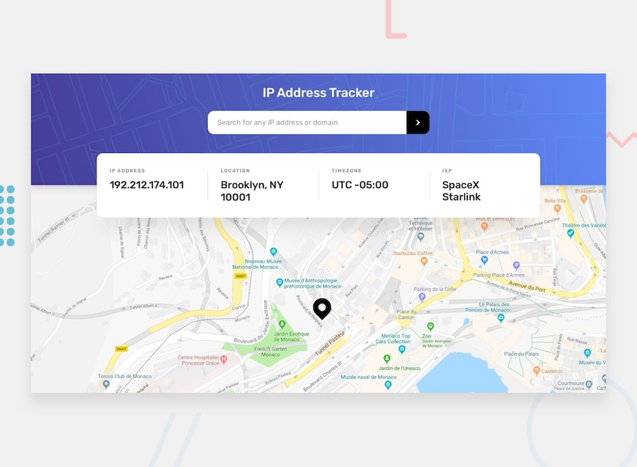
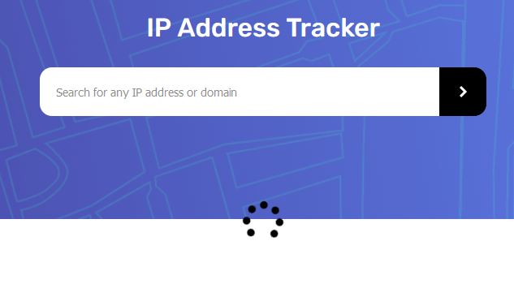

# Frontend Mentor - IP address tracker



## Welcome! 👋

## Table of contents

- [Overview](#overview)
  - [The challenge](#the-challenge)
  - [Screenshot](#screenshot)
  - [Links](#links)
- [My process](#my-process)
  - [Built with](#built-with)
  - [What I learned](#what-i-learned)
  - [Continued development](#continued-development)
  - [Useful resources](#useful-resources)
- [Author](#author)

## Overview

### The challenge

The users should be able to:

- View the optimal layout for each page depending on their device's screen size
- See hover states for all interactive elements on the page
- See their own IP address on the map on the initial page load
- Search for any IP addresses or domains and see the key information and location

---

For the mapping API, I do used [Mapbox](https://www.mapbox.com/). It's require an API Key to work, but give you 200k free tile requests. I also tried [leafletjs](https://leafletjs.com/), It's free and doesn't requiere an API Key, but finally decided for Mapbox. IP Address data and locations is provided by the [ipfy](https://www.ipify.org/) API.

---

### Links

- Solution URL: [Add solution URL here](https://your-solution-url.com)
- Live Site URL: [Add live site URL here](https://your-live-site-url.com)

## My process

### Built with

- Semantic HTML5 markup
- CSS custom properties
- CSS BEM Methodology
- Mobile-first workflow
- Flexbox
- Sass
- [Angular](https://angular.io/) - JS Framework
- Typescript

This challenge was made in Typescript, using [Angular](https://angular.io/) Framework, and it uses some of it's main features, such as data typing, shared components, services, observables, event emmiters, sharing data between components, form template approach with **NgForm module**, form validations, directives and more.

The API is consumed by a service that made GET resquests trought Angular HttpClient module, then serve the data to the components that require it.

**code example**
```ts
getPublicIp(): Observable<PublicIp> {
    return this.http.get('https://api.ipify.org?format=json')
    .pipe(map((resp: string) => {
      return resp['ip'];
    }),(catchError(err => [
      this.errorService.simpleErrorHandler(err)
    ])));
  }
```

I changed the structure of the data obtained by the [ipfy](https://www.ipify.org/) API using an interface through Angular's map operator.

**details-ip interface**
```ts
export interface DetailsIp {
    ip: string,
    isp: string,
    city: string,
    lat: number,
    lng: number,
    region: string,
    timezone: string
}
```
```ts
getIpAddressInfo(publicIp: PublicIp): Observable<void | DetailsIp> {
    return this.http.get(`${this.URL}${this.KEY}&ipAddress=${publicIp}`)
    .pipe(map((resp: DetailsIp) => {
      const details: DetailsIp = {
        ip: resp['ip'],
        isp: resp['isp'],
        city: resp['location'].city,
        lat: resp['location'].lat,
        lng: resp['location'].lng,
        region: resp['location'].region,
        timezone: resp['location'].timezone
      }
      return details;
    }),(catchError(err => [
      this.errorService.simpleErrorHandler(err)
    ])));
  }
```
I also did some extra work setting a simple error-handler service to catch API errors, as 403 Forbidden responses. 

Basic form validation for the IP address field.


And I also placed a spinner to know that data is being loaded.


**CSS BEM design methodology**
```html
<nav class="nav">
    <h1 class="nav__title">IP Address Tracker</h1>
    <form autocomplete="off" #form="ngForm" class="nav__form">
        <input class="nav__form-input" type="text" name="ip" [ngModel]="form.ip" placeholder="Search for any IP address or domain" required>
```
Styles made with [Sass](https://sass-lang.com/)

```scss
@mixin inputStyles()
    font-size: 18px
    border: none
    padding: 20px
    height: 100%

.nav 
    display: flex
    position: relative
    flex-direction: column
    align-items: center
    width: 100%
```

## Author

- Website - (not yet, working on content to show)
- Frontend Mentor - [@AbdielP](https://www.frontendmentor.io/profile/AbdielP)
- GitHub - [@AbdielP](https://github.com/AbdielP)